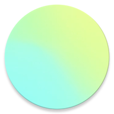

# Posso andare al mare?
Posso andare al mare? (Paalm) è un'applicazione Android minimalista e open source pensata per chi vuole sapere subito se la giornata è adatta per andare in spiaggia, senza perdersi in previsioni meteo complesse.

L'app analizza e interpreta i dati meteo essenziali (temperatura, precipitazioni, nuvolosità, radiazioni UV e vento) nella fascia oraria principale 08:00 - 19:00, restituendo un giudizio chiaro, sintetico e immediato sulla qualità della giornata al mare per i successivi 7 giorni.

Disponibile gratuitamente tramite GitHub e NeoStore, Paalm rispetta totalmente la privacy degli utenti: non traccia le attività online, non raccoglie dati personali ed è completamente priva di pubblicità.

## Tecnologie utilizzate
- Retrofit
- Kotlin
- Jetpack Compose
- Gson
